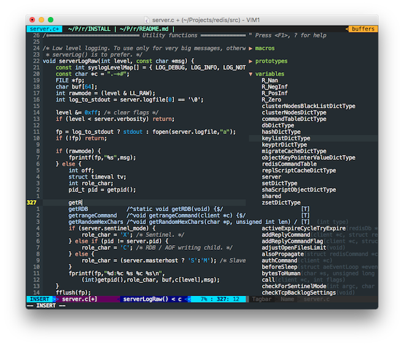

# Thomas Ding's Vim Configuration #


**Handy and Customizable!**

Utilize **NERDTree**, **Fugitive**, **Ctrl-P**, and many excellent plugins now.

## Installation ##

### The Automatic Way ###

In OS X and Linux where `curl` is installed, td-vimrc can be installed with one
command in the terminal:

1. **Clone the vimrc into your home directory:**

    ```shell
    $ curl https://raw.githubusercontent.com/thomasding/td-vimrc/master/install.sh | sh -
    ```

    It will clone td-vimrc into ~/.td-vimrc, clone Vundle (the package manager that
    this vimrc uses, which need cloning manually) into ~/.vim/bundle/Vundle.vim, and
    create local customizable vimrc files `~/.vimrc.before.local`, `~/.vimrc.after.local`
    and `~/.vimrc.plugin.local`, which are well self-documented.

2. **Enable extra features (optional):**

    Edit `~/.vimrc.before.local`and enable the features that you need. The extra
    features are mostly related to specific languages or terminal utilities. Skip
    this step if the basic feature is enough (see [Features] for what td-vimrc
    utilizes for a basic feature and extra features).

3. **Install all the plugins:**

    Run `:PluginInstall` in VIM or `vim +PluginInstall +qa` in terminal to install
    the plugins that td-vimrc requires for all the enabled features.


### The Manual Way ###

In Windows or OS X and Linux where `curl` is not available, td-vimrc has to be
installed manually by following these steps:

1. **Clone td-vimrc into your home directory:**

    ```shell
    $ git clone https://github.com/thomasding/td-vimrc.git ~/.td-vimrc
    ```

2. **Link the vimrc to ~/.vimrc:**

    1. In OS X or Linux, run the command in terminal:

        ```shell
        $ ln -s ~/.td-vimrc/vimrc ~/.vimrc
        ```

    2. In Windows, start CMD **as administrator**, change to home directory, and run:

        ```shell
        C:\Users\{Your Home}> mklink .vimrc .td-vimrc\vimrc
        ```

3. **Clone Vundle to your vim plugin directory:**

    ```shell
    $ git clone https://github.com/VundleVim/Vundle.vim.git ~/.vim/bundle/Vundle.vim
    ```

4. **Create local customizable vimrc files:**

    Create `~/.vimrc.before.local`, `~/.vimrc.after.local` and `~/.vimrc.plugin.local`
    in your home directory. See [Customization] for the descriptions of these files.

5. **Enable extra features (optional):**

    Edit `~/.vimrc.before.local` and set `g:tdvimrc_features` to enable extra
    features you need.

    ```VimL
    " The following statement enables all the extra features td-vimrc supports.
    " Remove unwanted features from the list. Set it to [] to disable all extra
    " features. See [Features] for the descriptions of each extra feature.
    let g:tdvimrc_features = ["golang", "html", "tmux"]
    ```

6. **Install all the plugins:**

    Run `:PluginInstall` in VIM or `$ vim +PluginInstall +qa` in terminal to
    install all the plugins td-vimrc requires for all enabled features.

## Features ##

### Basic Feature ###

1. **Enhance editing experience:**

    * Map `jj` to `<Esc>` in Insert mode.
    * Show relative line number.

        > Relative line number makes it faster to jump to a farther line. Jump to the
        > tenth line above the cursor, for example, with `10k` rather than `kkkkkkkkkk`.

    * Set default tab width and indentation to 4 spaces and use spaces in place
of tabs.

    * Enable incremental search and smart case. Highlight matched texts.

        > In smart case matching, `what` match `what`, `What` and `WHAT`, but `What`
        > matches `What` only.

        > To disable the matching highlight after searching, type `:noh` in Normal
        > mode.

    * Use `<Ctrl-h>`, `<Ctrl-l>`, `<Ctrl-j>` and `<Ctrl-k>` to switch between
window splits more quickly.

    * Trim trailing whitespaces automatically on save.

    * Automatically complete code with Neocomplete.

    * Undo to any previous state with undotree.

        > Undo history used to be a linear structure. You cannot return to the
        > original state after undoing to a previous state and then doing more
        > editing. Using undotree, the undo history forms a tree so that you
        > undoing and editing creates a new branch in the history tree, and you
        > are able to reach any state in the tree.

    * Add, substitute and remove brackets with vim-surround.

    * Enable Github Flavored Markdown syntax with vim-flavored-markdown.

    * Demonstrates variable, function and class definitions in the current file
with tagbar.

2. **Beautify the appearance of VIM:**

    * Powerful and beautiful status line with vim-airline working along with
many other plugins.

    * A full pack of hundreds of colorschemes with vim-colorschemes.

    * Hide menubar, toolbar and scrollbars by default.

    * Use good-looking monospace fonts in accord with the operating system.

3. **Improve finding file experience:**

    * Use Ctrl-P to quickly find files with fuzzy search.

    * Show your project directory in tree structure with NERDTree.

4. **Integrate with git:**

    * Seaminglessly manage your code in your git repo with fugitive.

    * Indicates modification besides the buffer with plus, minus and tilde signs
with vim-gitgutter.

    * Show git status in NERDTree by nerdtree-git-plugin.

### Extra Feature "golang" ###

Full golang development environment with [vim-go](https://github.com/fatih/vim-go).

### Extra Feature "html" ###

### Extra Feature "tmux" ###

## Guide ##

## Customization ##

## Snapshots ##

Git integration with **fugitive**:


Explore definitions with **tagbar** and complete code with **neocomplete**:



Undo to any previous state with **undotree**:


