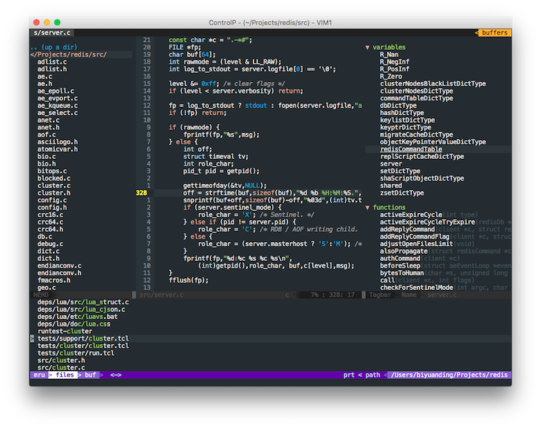
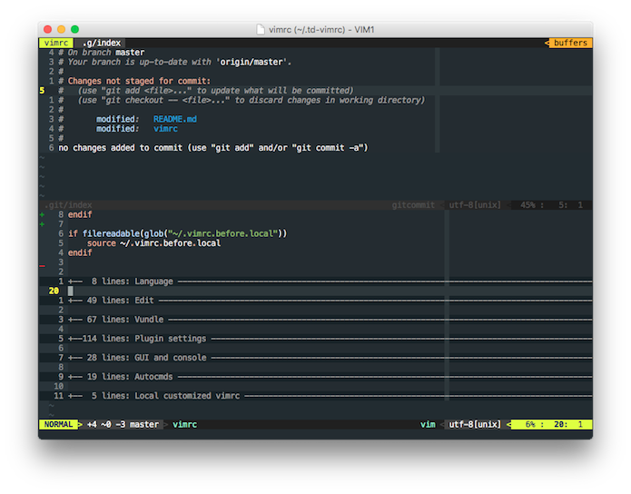

# Thomas Ding's Vim Configuration #



**Handy and Customizable!**

Utilize **NERDTree**, **Fugitive**, **Ctrl-P**, and many excellent plugins now.

## Installation ##

### The Automatic Way ###

In OS X and Linux where `curl` is installed, td-vimrc can be installed with one command in the terminal:

1. **Clone the vimrc into your home directory:**

    ```shell
    $ curl https://raw.githubusercontent.com/thomasding/td-vimrc/master/install.sh | sh -
    ```

    It will clone td-vimrc into ~/.td-vimrc, clone Vundle (the package manager that
    this vimrc uses, which need cloning manually) into ~/.vim/bundle/Vundle.vim, and
    create local customizable vimrc files `~/.vimrc.before.local`, `~/.vimrc.after.local`
    and `~/.vimrc.plugin.local`, which are well self-documented.

2. **Enable extra features (optional):**

    Edit `~/.vimrc.before.local`and enable the features that you need. The extra
    features are mostly related to specific languages or terminal utilities. Skip
    this step if the basic feature is enough (see [Features] for what td-vimrc
    utilizes for a basic feature and extra features).

3. **Install all the plugins:**

    Run `:PluginInstall` in VIM or `vim +PluginInstall +qa` in terminal to install
    the plugins that td-vimrc requires for all the enabled features.


### The Manual Way ###

In Windows or OS X and Linux where `curl` is not available, td-vimrc has to be installed manually by following these steps:

1. **Clone td-vimrc into your home directory:**

    ```shell
    $ git clone https://github.com/thomasding/td-vimrc.git ~/.td-vimrc
    ```

2. **Link the vimrc to ~/.vimrc:**

    1. In OS X or Linux, run the command in terminal:

        ```shell
        $ ln -s ~/.td-vimrc/vimrc ~/.vimrc
        ```

    2. In Windows, start CMD **as administrator**, change to home directory, and run:

        ```shell
        C:\Users\{Your Home}> mklink .vimrc .td-vimrc\vimrc
        ```

3. **Clone Vundle to your vim plugin directory:**

    ```shell
    $ git clone https://github.com/VundleVim/Vundle.vim.git ~/.vim/bundle/Vundle.vim
    ```

4. **Create local customizable vimrc files:**

    Create `~/.vimrc.before.local`, `~/.vimrc.after.local` and `~/.vimrc.plugin.local`
    in your home directory. See [Customization] for the descriptions of these files.

5. **Enable extra features (optional):**

    Edit `~/.vimrc.before.local` and set `g:tdvimrc_features` to enable extra features you need.

    ```VimL
    " The following statement enables all the extra features td-vimrc supports.
    " Remove unwanted features from the list. Set it to [] to disable all extra
    " features. See [Features] for the descriptions of each extra feature.
    let g:tdvimrc_features = ["golang", "web", "tmux"]
    ```

6. **Install all the plugins:**

    Run `:PluginInstall` in VIM or `$ vim +PluginInstall +qa` in terminal to
    install all the plugins td-vimrc requires for all enabled features.

## Features ##

### Basic Feature ###

1. **Enhance editing experience:**

    * Map `jj` to `<Esc>` in Insert mode.
    * Show relative line number.

        > Relative line number makes it faster to jump to a farther line. Jump to the
        > tenth line above the cursor, for example, with `10k` rather than `kkkkkkkkkk`.

    * Set default tab width and indentation to 4 spaces and use spaces in place
of tabs.

    * Enable incremental search and smart case. Highlight matched texts.

        > In smart case matching, `what` match `what`, `What` and `WHAT`, but `What`
        > matches `What` only.

        > To disable the matching highlight after searching, type `:noh` in Normal
        > mode.

    * Use `<Ctrl-h>`, `<Ctrl-l>`, `<Ctrl-j>` and `<Ctrl-k>` to switch between window splits more quickly.

    * Trim trailing whitespaces automatically on save.

    * Automatically complete code with [neocomplete](https://github.com/Shougo/neocomplete.vim).

        > Neocomplete depends on Lua support of vim.
        > Run `:echo has('lua')` in your vim to see if it supports Lua.
        > `1` indicates your vim supports Lua and `0` indicates not.

        > To install a macvim with lua support in OS X, run in terminal:

        ```shell
        $ brew install macvim --with-lua --with-override-system-vim
        $ brew linkapps macvim
        ```

        > `--with-override-system-vim` instructs macvim to replace system default vim.

        > Neocomplete shows a popup with candidates while you are typing.
        > Press `<Tab>` to switch between the candidates in the popup.
        > Just ignore the popup if the completion does not satisfy the expectation.

    * Undo to any previous state with [undotree](https://github.com/Shougo/neocomplete.vim).

        > Undo history used to be a linear structure. You cannot return to the
        > original state after undoing to a previous state and then doing more
        > editing. Using undotree, the undo history forms a tree so that you
        > undoing and editing creates a new branch in the history tree, and you
        > are able to reach any state in the tree.

        > To toogle the undo tree window, press `,u` in Normal mode.
        > Move the cursor to the preferred state in the tree and press `<Enter>` to revert to a previous state.

        > `>{Number}<` indicates the current state. `S` and `s` indicate the save point.
        > The small window below the history demonstrates the difference between the two adjacent state.
        > While switching between history states, the changing lines in the buffer is highlighted.

    * Add, substitute and remove brackets with [vim-surround](https://github.com/tpope/vim-surround).

        > Press `cs"'` inside `"Hello World!" to change it to `'Hello World!'`.

        > Press `cs'<q>` to change it to `<q>Hello World!</q>`.

        > Press `ds"` to remove the delimiters and change it to `Hello World!`.

        > Press `ysiw]` (`iw` is a text object indicating a word) on `Hello` of `Hello World!` to change it to `[Hello] World!`.

        > See more usage from the documentation of [vim-surround](https://github.com/tpope/vim-surround).

    * Enable Github Flavored Markdown syntax with [vim-flavored-markdown](https://github.com/jtratner/vim-flavored-markdown).

    * Demonstrates variable, function and class definitions in the current file with [tagbar](https://github.com/majutsushi/tagbar).

        > Press `,t` in Normal mode to toggle the tagbar.

        > Tagbar uses [exuberant ctags](http://ctags.sourceforge.net) to process the editing file in memory.
        > It does not refer to any real tags file.

        > To install exuberant ctags in OS X, run `brew install ctags` in terminal.

2. **Beautify the appearance of VIM:**

    * Powerful and beautiful status line with [vim-airline](https://github.com/bling/vim-airline) working along with many other plugins.

    * A full pack of hundreds of colorschemes with [vim-colorschemes](https://github.com/flazz/vim-colorschemes).

        > By default, td-vimrc applies `codeschool` if vim is running in GUI and `gruvbox` if in terminal.

        > Press `:colorscheme ` (there is a whitespace after `colorscheme`) and `<Tab>` to list all the colorschemes.

    * Hide menubar, toolbar and scrollbars by default.

    * Use good-looking monospace fonts according to the operating system.

        > Td-vimrc chooses Monaco in OS X, Monospace in Linux and Consolas in Windows by default.

3. **Improve finding file experience:**

    * Use [ctrlp](https://github.com/kien/ctrlp.vim) to quickly find files with fuzzy search.

        > Press `<Ctrl-p>` in Normal mode to bring the ctrlp panel in appearance.

        > Here are some most frequent key bindings used in ctrlp panel:

        | Key      | Description                                          |
        | -------- | ---------------------------------------------------- |
        | Ctrl-j   | Move down the cursor to the next line                |
        | Ctrl-k   | Move up the cursor to the previous line              |
        | Ctrl-f   | Iterate forward between file, buffer and MRU list    |
        | Ctrl-b   | Iterate backward between file, buffer and MRU list   |
        | Enter    | Open the selected file(s)                            |
        | Ctrl-x   | Open the file in a new horizontal split              |
        | Ctrl-v   | Open the file in a new vertical split                |
        | Ctrl-y   | Create the file and its parent directories           |
        | F5       | Refresh the list                                     |

        > See the full list of supported actions in [ctrlp](https://github.com/kien/ctrlp.vim).

    * Show your project directory in tree structure with [NERDTree](https://github.com/scrooloose/nerdtree).

        > Press `,n` in Normal mode to jump to the NERDTree window, opening it if hidden.

        > Press `,N` in Normal mode to toggle the NERDTree window.

        > Here are some most frequent key bindings used in NEDTree window:

        | Key   | Description                                             |
        | ----- | ------------------------------------------------------- |
        | ?     | Toggle help                                             |
        | j     | Move down the cursor to the next line                   |
        | k     | Move up the cursor to the previous line                 |
        | o     | Open the selected file or toggle the selected directory |
        | i     | Open in a new horizontal split                          |
        | v     | Open in a new vertical split                            |
        | r     | Refresh the list                                        |

4. **Integrate with git:**

    * Seamlessly manage your code in your git repo with [fugitive](https://github.com/tpope/vim-fugitive).

        > Td-vimrc comes with a few key bindings in Normal mode for frequent git action:

        | Shortcut | Command  | Description                                                                                    |
        | -------- | -------- | ---------------------------------------------------------------------------------------------  |
        | ,gs      | :Gstatus | Show the status of the repo. Press `-` on a file to toggle between staged and unstaged state.  |
        | ,gw      | :Gwrite  | Save the buffer and stage it in the repo                                                       |
        | ,gc      | :Gcommit | Bring up a commit window. Press `:wq` in it to apply the commit or `:q!` to abandon the commit |
        | ,gd      | :Gdiff   | Diff the file with the one in HEAD                                                             |
        | ,gb      | :Gblame  | Blame the file                                                                                 |

        > See [fugitive](https://github.com/tpope/vim-fugitive) for more documentation.

    * Indicates modification besides the buffer with plus, minus and tilde signs with [vim-gitgutter](https://github.com/airblade/vim-gitgutter).

    * Show git status in NERDTree by [nerdtree-git-plugin](https://github.com/Xuyuanp/nerdtree-git-plugin).

5. **Powerful plugin management with [Vundle](https://github.com/VundleVim/Vundle.vim).**

### Extra Feature "golang" ###

* Full golang development environment with [vim-go](https://github.com/fatih/vim-go).

### Extra Feature "web" ###

* Expand HTML and CSS abbreviations with [Emmet-vim](https://github.com/mattn/emmet-vim).

* Enhanced [javascript syntax highlighting](https://github.com/pangloss/vim-javascript).

* [HTML5 syntax highlighting](https://github.com/othree/html5.vim) support.

### Extra Feature "tmux" ###

* Unite tmux with vim-airline by [tmuxline.vim](https://github.com/edkolev/tmuxline.vim).

    > To support tmuxline on the startup of tmux, run `:TmuxlineSnapshot [file]` to create a snapshot
    > which can be sourced by ~/.tmux.conf on startup.

    > To source the created snapshot, add the following lines in your ~/.tmux.conf:

    ```
    # in ~/.tmux.conf
    source-file [file]
    ```

* Switching tmux panes and vim window splits seamlessly with `<Ctrl-h>`, `<Ctrl-l>`, `<Ctrl-j>`
and `<Ctrl-k>` by [vim-tmux-navigator](https://github.com/christoomey/vim-tmux-navigator).

    > To support switching panes in tmux, append the following code in your ~/.tmux.conf:

    ```
    # Smart pane switching with awareness of vim splits
    # See: https://github.com/christoomey/vim-tmux-navigator
    is_vim='echo "#{pane_current_command}" | grep -iqE "(^|\/)g?(view|n?vim?x?)(diff)?$"'
    bind -n C-h if-shell "$is_vim" "send-keys C-h" "select-pane -L"
    bind -n C-j if-shell "$is_vim" "send-keys C-j" "select-pane -D"
    bind -n C-k if-shell "$is_vim" "send-keys C-k" "select-pane -U"
    bind -n C-l if-shell "$is_vim" "send-keys C-l" "select-pane -R"
    bind -n C-\ if-shell "$is_vim" "send-keys C-\\" "select-pane -l"
    ```

## Customization ##

> **DO NOT edit .vimrc.** Your changes will be lost after updating your vimrc configuration.

To customize your vim, edit `~/.vimrc.before.local`, `~/.vimrc.after.local` and `~/.vimrc.plugin.local`, respectively.

1. `~/.vimrc.before.local`: loaded at the very beginning of `~/.vimrc`.

    Enable extra features by setting `g:tdvimrc_features` in this file.
    An example is:

    ```VimL
    " The following statement enables all the extra features td-vimrc supports.
    " Remove unwanted features from the list. Set it to [] to disable all extra
    " features. See [Features] for the descriptions of each extra feature.
    let g:tdvimrc_features = ["golang", "web", "tmux"]
    ```

    Every time the features are changed, run `:PluginClean` and `:PluginInstall` in vim to apply the changes.

2. `~/.vimrc.plugin.local`: loaded while loading Vundle plugins.

    Add your plugins to this file. An example is:

    ```VimL
    " Ctrl-P helps finding files faster.
    Plugin 'kien/ctrlp.vim'
    ```

    Every time plugins are added or removed, run `:PluginClean` and `:PluginInstall` in vim to apply the changes.

3. `~/.vimrc.after.local`: loaded at the very end of `~/.vimrc`.

    Override tdvimrc's default configuration and add your own commands in this file.

## Update ##

1. Open terminal and change to directory `~/.td-vimrc`. Run the command to pull the latest td-vimrc:

    ```shell
    $ git pull
    ```

2. Run `:PluginUpdate` in vim to update the plugins.

## Snapshots ##

Git integration with **fugitive**:



Explore definitions with **tagbar** and complete code with **neocomplete**:


Undo to any previous state with **undotree**:


